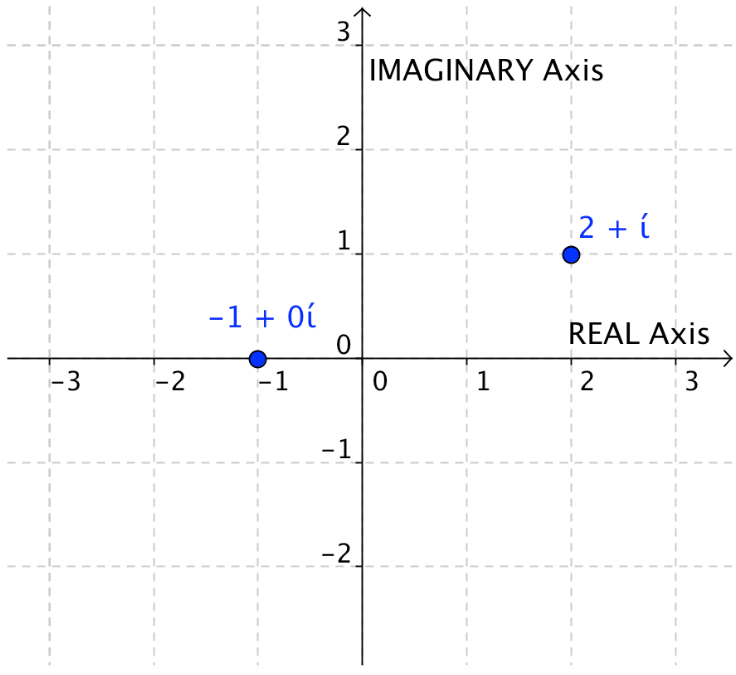
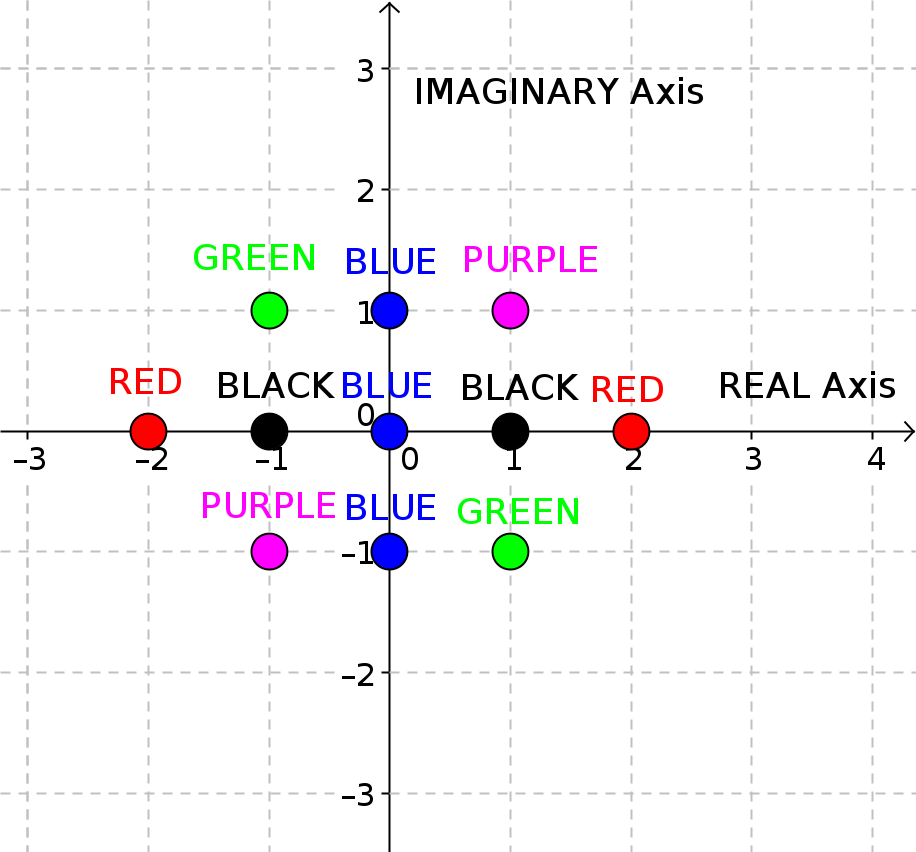

Homework Section I (Practice)
-----------------------------

Part A
~~~~~~

1. .. include:: practice/A.1q.rst
2. .. include:: practice/A.2q.rst
3. .. include:: practice/A.3q.rst
4. .. include:: practice/A.4q.rst
5. .. include:: practice/A.5q.rst

-----------------------------------

Part B
~~~~~~

In Algebra you saw how completing the square can lead to a generic formula for
solving quadratics called:

.. topic:: The Quadratic Formula(s)

    The zeros of the function :math:`f(x)=ax^2+bx+c` are given by:
    :math:`\frac {-b \pm \sqrt{b^2-4ac}}{2a} ~~~(a \ne 0)`

For the next two questions, solve using any technique. Use factoring and
completing the square at least once.

1. .. include:: practice/B.1q.rst

.. include:: practice/B.2p.rst

2. .. include:: practice/B.2q.rst
3. .. include:: practice/B.3q.rst
4. .. include:: practice/B.4q.rst
5. .. include:: practice/B.5q.rst

Part C
~~~~~~

1. .. include:: practice/C.1q.rst
2. .. include:: practice/C.2q.rst
3. .. include:: practice/C.3q.rst
4. .. include:: practice/C.4q.rst
5. .. include:: practice/C.5q.rst

Homework Section II (Application)
---------------------------------

Complex numbers have a **real part** and an **imaginary part**, so they are 
plotted on a 2D grid where the imaginary part is on the vertical axis and the
real part is on the horizontal axis. The figure below shows how two complex 
numbers are plotted on this plane.

The first number, **-1+0i**, is really just the real number: -1. It is located
on the horizontal REAL axis, the same way you would locate a point on the 
REAL number line.

The second number, **2+1i**, is imaginary and is positioned above the 2 on 
the REAL axis and adjacent to the 1i on the IMAGINARY axis.

To plot a function in complex numbers, you have to encode the resulting values
using color. We can use a very simple system to do this:

===============   ====================================
Use this color:   to plot f(x) values that are:
===============   ====================================
Red               Positive pure REAL numbers
Blue              Negative pure REAL numbers
Black             ZERO
Purple            Numbers with positive IMAGINARY part
Green             Numbers with negative IMAGINARY part
===============   ====================================

.. topic:: Assignment

    A) Look at the following **example** of plotting :math:`f(x)=x^2-1`, 
       then **construct** your own table for :math:`g(x)=x^2+1` and plot the 
       points on graph paper using appropriately colored pencils.
    B) Using algebra, find the zeros of :math:`g(x)=x^2+1`. Label the zeros on the 
       grid that you colored in.
       

EXAMPLE
~~~~~~~

======== ================== =======
x        :math:`f(x)=x^2-1` color
======== ================== =======
-2       3                  red
-1       0                  black
0        -1                 blue
1        0                  black
2        3                  red
-1+i     -1-2i              green
i        -2                 blue
1+i      -1+2i              purple
-1-i     -1+2i              purple
-i       -2                 blue
1-i      -1-2i              green
======== ================== =======

YOUR TURN
~~~~~~~~~

======== ================== =======
x        :math:`g(x)=x^2+1` color
======== ================== =======
-2       5                  red
-1                          
0                           
1                            
2                            
-1+i                         
i                            
1+i                          
2i       
-1-i                         
-i                           
1-i                          
-2i
======== ================== =======

Now plot g(x) on your own graph paper. Don't forget: **where** you plot g(x)
is determined by where x is on the imaginary plane. The **value** of g(x) is
represented by the color that you use, and not its location!

Don't forget to answer part 2 of the original question!

